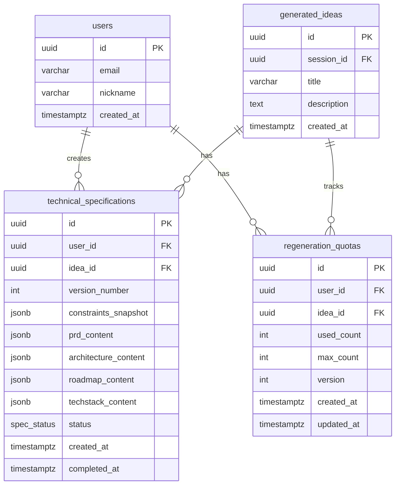

# Stage C - Data Model

**Feature**: Stage C - Technical Execution
**Branch**: `005-stage-c-execution`
**Date**: 2025-01-02

---

## Overview

Stage C introduces two new main tables and one supporting table to track technical specifications generated by the Tech Architect Agent (Agent 3). The design follows existing patterns from `generation_sessions` and `generated_ideas` tables.

---

## Entity Relationship Diagram



---

## New Tables

### 1. `technical_specifications`

Stores the complete technical specification package generated by Tech Architect Agent.

```sql
-- Enum for specification status
CREATE TYPE spec_status AS ENUM ('generating', 'completed', 'failed');

-- Main specifications table
CREATE TABLE technical_specifications (
    id UUID PRIMARY KEY DEFAULT gen_random_uuid(),
    user_id UUID NOT NULL REFERENCES users(id) ON DELETE CASCADE,
    idea_id UUID NOT NULL REFERENCES generated_ideas(id) ON DELETE CASCADE,

    -- Version tracking (1 = initial, 2-4 = regenerations)
    version_number INTEGER NOT NULL DEFAULT 1,

    -- User constraints at time of generation (frozen snapshot)
    constraints_snapshot JSONB NOT NULL,

    -- Generated documents (stored as JSON for flexibility)
    prd_content JSONB NOT NULL,
    architecture_content JSONB NOT NULL,
    roadmap_content JSONB NOT NULL,
    techstack_content JSONB NOT NULL,

    -- Status tracking
    status spec_status NOT NULL DEFAULT 'generating',
    error_message TEXT,

    -- Timestamps
    created_at TIMESTAMPTZ NOT NULL DEFAULT NOW(),
    completed_at TIMESTAMPTZ,

    -- Constraints
    CONSTRAINT unique_spec_version UNIQUE (idea_id, version_number),
    CONSTRAINT valid_version_number CHECK (version_number >= 1 AND version_number <= 4)
);

-- Indexes
CREATE INDEX idx_tech_specs_user_id ON technical_specifications(user_id);
CREATE INDEX idx_tech_specs_idea_id ON technical_specifications(idea_id);
CREATE INDEX idx_tech_specs_status ON technical_specifications(status);
```

#### Column Details

| Column | Type | Description |
|--------|------|-------------|
| `id` | UUID | Primary key |
| `user_id` | UUID | User who created the specification (FK → users) |
| `idea_id` | UUID | Source idea from Stage B (FK → generated_ideas) |
| `version_number` | INTEGER | 1 = initial, 2-4 = regenerations |
| `constraints_snapshot` | JSONB | Frozen copy of user constraints at generation time |
| `prd_content` | JSONB | Product Requirements Document |
| `architecture_content` | JSONB | System architecture with Mermaid diagram |
| `roadmap_content` | JSONB | MVP development phases |
| `techstack_content` | JSONB | Technology recommendations with rationale |
| `status` | spec_status | generating → completed / failed |
| `error_message` | TEXT | Error details if status = failed |
| `created_at` | TIMESTAMPTZ | When generation started |
| `completed_at` | TIMESTAMPTZ | When generation finished |

---

### 2. `regeneration_quotas`

Tracks regeneration usage per user-idea pair with optimistic locking support.

```sql
CREATE TABLE regeneration_quotas (
    id UUID PRIMARY KEY DEFAULT gen_random_uuid(),
    user_id UUID NOT NULL REFERENCES users(id) ON DELETE CASCADE,
    idea_id UUID NOT NULL REFERENCES generated_ideas(id) ON DELETE CASCADE,

    -- Quota tracking
    used_count INTEGER NOT NULL DEFAULT 0,
    max_count INTEGER NOT NULL DEFAULT 3,

    -- Optimistic locking version
    version INTEGER NOT NULL DEFAULT 1,

    -- Timestamps
    created_at TIMESTAMPTZ NOT NULL DEFAULT NOW(),
    updated_at TIMESTAMPTZ NOT NULL DEFAULT NOW(),

    -- Constraints
    CONSTRAINT unique_user_idea_quota UNIQUE (user_id, idea_id),
    CONSTRAINT valid_quota_count CHECK (used_count >= 0 AND used_count <= max_count)
);

-- Index for lookups
CREATE INDEX idx_regen_quotas_user_idea ON regeneration_quotas(user_id, idea_id);

-- Trigger for updated_at
CREATE OR REPLACE FUNCTION update_regen_quota_timestamp()
RETURNS TRIGGER AS $$
BEGIN
    NEW.updated_at = NOW();
    RETURN NEW;
END;
$$ LANGUAGE plpgsql;

CREATE TRIGGER trg_regen_quota_updated_at
    BEFORE UPDATE ON regeneration_quotas
    FOR EACH ROW EXECUTE FUNCTION update_regen_quota_timestamp();
```

#### Column Details

| Column | Type | Description |
|--------|------|-------------|
| `id` | UUID | Primary key |
| `user_id` | UUID | User (FK → users) |
| `idea_id` | UUID | Idea being regenerated (FK → generated_ideas) |
| `used_count` | INTEGER | Number of regenerations used (0-3) |
| `max_count` | INTEGER | Maximum allowed regenerations (default 3) |
| `version` | INTEGER | Optimistic locking version counter |
| `created_at` | TIMESTAMPTZ | When quota record was created |
| `updated_at` | TIMESTAMPTZ | Last modification time |

---

## JSONB Schema Definitions

### `constraints_snapshot` Schema

```typescript
interface ConstraintsSnapshot {
  budget: {
    range: 'UNDER_10M' | '10M_TO_50M' | '50M_TO_200M' | 'OVER_200M';
    specificAmount?: number; // in KRW
    displayText: string; // e.g., "1,000만원~5,000만원"
  };
  team: {
    size: number;
    composition: {
      junior: number;
      middle: number;
      senior: number;
    };
  };
  timeline: '1_TO_3_MONTHS' | '3_TO_6_MONTHS' | '6_TO_12_MONTHS' | 'OVER_12_MONTHS';
  techPreferences?: {
    languages?: string[];
    frameworks?: string[];
    platforms?: string[];
  };
  existingInfrastructure?: string[];
}
```

### `prd_content` Schema

```typescript
interface PRDContent {
  title: string;
  overview: string;
  requirements: Array<{
    id: string; // e.g., "REQ-001"
    priority: 'P0' | 'P1' | 'P2' | 'P3';
    description: string;
    acceptanceCriteria: string[];
  }>;
  userStories: string[];
  scope: {
    included: string[];
    excluded: string[];
  };
}
```

### `architecture_content` Schema

```typescript
interface ArchitectureContent {
  diagramCode: string; // Mermaid.js code
  components: Array<{
    name: string;
    description: string;
    technology: string;
    responsibilities: string[];
  }>;
  integrations: string[];
}
```

### `roadmap_content` Schema

```typescript
interface RoadmapContent {
  phases: Array<{
    name: string; // e.g., "Phase 1: MVP 코어"
    duration: string; // e.g., "4주"
    milestones: string[];
    deliverables: string[];
    dependencies?: string[];
  }>;
  totalDuration: string; // e.g., "3개월"
}
```

### `techstack_content` Schema

```typescript
interface TechStackContent {
  recommendations: Array<{
    category: 'frontend' | 'backend' | 'database' | 'infrastructure' | 'monitoring' | 'ci_cd';
    recommended: string;
    alternatives: string[];
    rationale: string; // Why this choice fits user constraints
    estimatedCost: string; // Monthly cost in KRW
    constraintAlignment: {
      budget: string;
      team: string;
      timeline: string;
    };
  }>;
}
```

---

## TypeScript Type Definitions

```typescript
// types/stage-c.ts

export type BudgetRange = 'UNDER_10M' | '10M_TO_50M' | '50M_TO_200M' | 'OVER_200M';
export type Timeline = '1_TO_3_MONTHS' | '3_TO_6_MONTHS' | '6_TO_12_MONTHS' | 'OVER_12_MONTHS';
export type SpecStatus = 'generating' | 'completed' | 'failed';
export type Priority = 'P0' | 'P1' | 'P2' | 'P3';
export type TechCategory = 'frontend' | 'backend' | 'database' | 'infrastructure' | 'monitoring' | 'ci_cd';

export interface UserConstraints {
  budget: {
    range: BudgetRange;
    specificAmount?: number;
    displayText: string;
  };
  team: {
    size: number;
    composition: {
      junior: number;
      middle: number;
      senior: number;
    };
  };
  timeline: Timeline;
  techPreferences?: {
    languages?: string[];
    frameworks?: string[];
    platforms?: string[];
  };
  existingInfrastructure?: string[];
}

export interface PRDDocument {
  title: string;
  overview: string;
  requirements: Array<{
    id: string;
    priority: Priority;
    description: string;
    acceptanceCriteria: string[];
  }>;
  userStories: string[];
  scope: {
    included: string[];
    excluded: string[];
  };
}

export interface ArchitectureDiagram {
  diagramCode: string;
  diagramSvg?: string; // Rendered SVG (client-side only)
  components: Array<{
    name: string;
    description: string;
    technology: string;
    responsibilities: string[];
  }>;
  integrations: string[];
}

export interface MVPRoadmap {
  phases: Array<{
    name: string;
    duration: string;
    milestones: string[];
    deliverables: string[];
    dependencies?: string[];
  }>;
  totalDuration: string;
}

export interface TechStackRecommendation {
  category: TechCategory;
  recommended: string;
  alternatives: string[];
  rationale: string;
  estimatedCost: string;
  constraintAlignment: {
    budget: string;
    team: string;
    timeline: string;
  };
}

export interface TechnicalSpecification {
  id: string;
  userId: string;
  ideaId: string;
  versionNumber: number;
  constraintsSnapshot: UserConstraints;
  prd: PRDDocument;
  architecture: ArchitectureDiagram;
  roadmap: MVPRoadmap;
  techStack: TechStackRecommendation[];
  status: SpecStatus;
  errorMessage?: string;
  createdAt: string;
  completedAt?: string;
}

export interface RegenerationQuota {
  id: string;
  userId: string;
  ideaId: string;
  usedCount: number;
  maxCount: number;
  version: number;
  createdAt: string;
  updatedAt: string;
}

// API Request/Response types
export interface CreateSpecificationRequest {
  ideaId: string;
  constraints: UserConstraints;
}

export interface RegenerateSpecificationRequest {
  constraints: UserConstraints;
}

export interface SpecificationResponse {
  specification: TechnicalSpecification;
  remainingRegenerations: number;
}

export interface ExportFormat = 'pdf' | 'markdown';

export interface ExportRequest {
  format: ExportFormat;
}
```

---

## Migration SQL

Complete SQL script for adding Stage C tables to existing Supabase schema:

```sql
-- Migration: Add Stage C tables
-- Run this in Supabase SQL Editor

-- 1. Create enum for specification status
DO $$
BEGIN
    IF NOT EXISTS (SELECT 1 FROM pg_type WHERE typname = 'spec_status') THEN
        CREATE TYPE spec_status AS ENUM ('generating', 'completed', 'failed');
    END IF;
END$$;

-- 2. Create technical_specifications table
CREATE TABLE IF NOT EXISTS technical_specifications (
    id UUID PRIMARY KEY DEFAULT gen_random_uuid(),
    user_id UUID NOT NULL REFERENCES users(id) ON DELETE CASCADE,
    idea_id UUID NOT NULL REFERENCES generated_ideas(id) ON DELETE CASCADE,
    version_number INTEGER NOT NULL DEFAULT 1,
    constraints_snapshot JSONB NOT NULL,
    prd_content JSONB NOT NULL,
    architecture_content JSONB NOT NULL,
    roadmap_content JSONB NOT NULL,
    techstack_content JSONB NOT NULL,
    status spec_status NOT NULL DEFAULT 'generating',
    error_message TEXT,
    created_at TIMESTAMPTZ NOT NULL DEFAULT NOW(),
    completed_at TIMESTAMPTZ,
    CONSTRAINT unique_spec_version UNIQUE (idea_id, version_number),
    CONSTRAINT valid_version_number CHECK (version_number >= 1 AND version_number <= 4)
);

-- 3. Create regeneration_quotas table
CREATE TABLE IF NOT EXISTS regeneration_quotas (
    id UUID PRIMARY KEY DEFAULT gen_random_uuid(),
    user_id UUID NOT NULL REFERENCES users(id) ON DELETE CASCADE,
    idea_id UUID NOT NULL REFERENCES generated_ideas(id) ON DELETE CASCADE,
    used_count INTEGER NOT NULL DEFAULT 0,
    max_count INTEGER NOT NULL DEFAULT 3,
    version INTEGER NOT NULL DEFAULT 1,
    created_at TIMESTAMPTZ NOT NULL DEFAULT NOW(),
    updated_at TIMESTAMPTZ NOT NULL DEFAULT NOW(),
    CONSTRAINT unique_user_idea_quota UNIQUE (user_id, idea_id),
    CONSTRAINT valid_quota_count CHECK (used_count >= 0 AND used_count <= max_count)
);

-- 4. Create indexes
CREATE INDEX IF NOT EXISTS idx_tech_specs_user_id ON technical_specifications(user_id);
CREATE INDEX IF NOT EXISTS idx_tech_specs_idea_id ON technical_specifications(idea_id);
CREATE INDEX IF NOT EXISTS idx_tech_specs_status ON technical_specifications(status);
CREATE INDEX IF NOT EXISTS idx_regen_quotas_user_idea ON regeneration_quotas(user_id, idea_id);

-- 5. Create trigger for updated_at
CREATE OR REPLACE FUNCTION update_regen_quota_timestamp()
RETURNS TRIGGER AS $$
BEGIN
    NEW.updated_at = NOW();
    RETURN NEW;
END;
$$ LANGUAGE plpgsql;

DROP TRIGGER IF EXISTS trg_regen_quota_updated_at ON regeneration_quotas;
CREATE TRIGGER trg_regen_quota_updated_at
    BEFORE UPDATE ON regeneration_quotas
    FOR EACH ROW EXECUTE FUNCTION update_regen_quota_timestamp();

-- Success message
SELECT 'Stage C tables created successfully!' as status;
```

---

## Relationships with Existing Tables

| Stage C Table | Related Table | Relationship |
|---------------|---------------|--------------|
| `technical_specifications` | `users` | Many-to-One (user creates specs) |
| `technical_specifications` | `generated_ideas` | Many-to-One (idea has versions) |
| `regeneration_quotas` | `users` | Many-to-One |
| `regeneration_quotas` | `generated_ideas` | Many-to-One |

### Access Patterns

1. **Get all specifications for a user**: `WHERE user_id = ?`
2. **Get specification versions for an idea**: `WHERE idea_id = ? ORDER BY version_number`
3. **Get latest specification**: `WHERE idea_id = ? ORDER BY version_number DESC LIMIT 1`
4. **Check regeneration quota**: `WHERE user_id = ? AND idea_id = ?`
